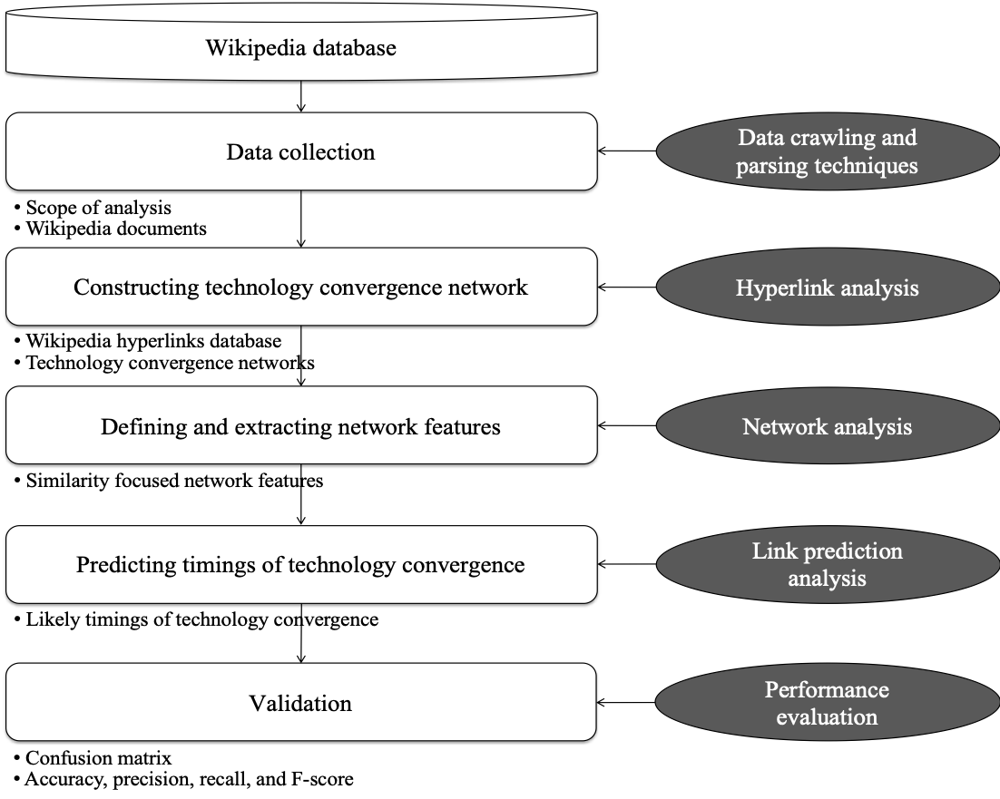

# Timing-analysis-of-technology-convergence
Research framework and Python implementation of the research 'Timing analysis of technology convergence'

***

Description
-----------
Python codes to conduct the research "Timing analysis of technology convergence".

Given the data (looks like the one in the folder 'data'), the analysis shown in the research framework is conducted.

The codes consist of following parts.
  1. Data loading and pre-processing
  2. Defining and extracting ten node similarity measures
  3. Predicting timings of technology convergence via a variety of classification algorithms
    3.1. Grid search for KNN, SVM, Random forest is included
  4. Validation using the k-fold cross validation
  

Prerequisites
-------------
1. Python (the codes in this repository are developed using Python verison 3.6.6)
2. You need several external packages, and they are mentioned in the python file.

